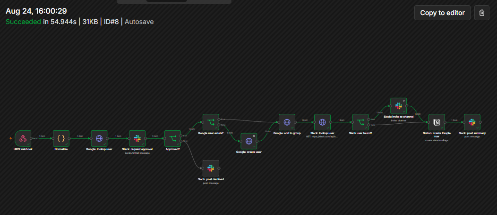

# n8n-hris-provisioning

[](https://github.com/Aquinas-Protocol/n8n-hris-provisioning/actions/workflows/ci.yml)

A new-hire provisioning pipeline in **n8n 2.35.7**: a mock HRIS webhook comes in, a human
approves in Slack, and the flow creates the Google Workspace account (against a bundled mock
of the Admin SDK), adds it to the department group, invites the hire to their Slack onboarding
channel, writes the Notion `People` row, and posts a summary. Anything that breaks lands in
`#it-alerts` through a separate error workflow.

Self-hosted, JSON-in-git, importable from the CLI, runnable by a stranger with
`docker compose up`.

## TL;DR

Per `employee.hired` event:

1. **Ingress gate** — the webhook only accepts requests carrying the shared `X-HRIS-Token`
   header (n8n Header Auth). Wrong token = 403, no execution, nothing to clean up.
2. **Normalize** — a Code node validates the payload (event type, required fields,
   `YYYY-MM-DD` start date not older than 30 days), derives `first.last@<domain>`, and maps the
   department to a Google group and a Slack onboarding channel from two env maps.
3. **Human gate** — Slack *Send and Wait* posts the request with **Approve / Decline** buttons
   and blocks the execution. No click within **1 hour** = declined. Nothing is created before
   approval.
4. **Idempotent steps** — Google user is looked up first (create only on 404; 409 on the group
   add means "already a member"); Slack invite tolerates `already_in_channel`; re-firing the
   same event is safe and the summary says what was skipped.
5. **Summary** — one Slack message listing what was created, what already existed, and what is
   pending (a hire with no Slack account yet is reported as *pending SCIM/SSO*, not failed).
6. **Error lane** — any throw routes to a second workflow that posts the failed node, the error
   message, and the execution link to `#it-alerts`.



## Architecture

```
HRIS (curl) ──POST /webhook/hris/new-hire──▶ [Webhook · header auth]
                                                │
                                                ▼
                                          [Normalize · Code]
                                                │
                                                ▼
                                   [Google: lookup user · GET]  (mock Admin SDK)
                                                │
                                                ▼
                              [Slack: request approval · Send & Wait] ──no/timeout──▶ [Slack: post declined]
                                                │ yes
                                                ▼
                                      [Google user exists?] ──no──▶ [Google: create user · POST, 3 retries]
                                                │ yes                          │
                                                ▼◀────────────────────────────┘
                                      [Google: add to group · POST]  (409 = already a member)
                                                │
                                                ▼
                                   [Slack: lookup user · users.lookupByEmail]
                                                │
                                      [Slack user found?] ──yes──▶ [Slack: invite to channel] (errors continue)
                                                │ no                            │
                                                ▼◀─────────────────────────────┘
                                    [Notion: create People row]
                                                │
                                                ▼
                                       [Slack: post summary]

any node throws ──▶ (Error Workflow) [Error Trigger] ──▶ [Slack: alert #it-alerts]
```

| Leg               | Real or mocked                                                   |
|-------------------|------------------------------------------------------------------|
| HRIS              | Mocked by `samples/new-hire.json` + `scripts/fire-webhook.*`     |
| Approval in Slack | **Real** Slack workspace, bot token, link-button approval        |
| Google Workspace  | **Mocked** Directory API (`mock-google-admin/`), real request/response shapes |
| Slack invite      | **Real** (`users.lookupByEmail` + `conversations.invite`)        |
| Notion            | **Real** internal integration, `People` database                 |
| Error alerts      | **Real** Slack message from the error workflow                   |

## Run it

### Docker (what CI runs)

```bash
cp .env.example .env            # then edit: encryption key, channel ids, Notion data-source id, HRIS token
docker compose up -d --build    # n8n on :5678, mock Admin SDK on :8000
./scripts/import-workflows.sh   # upserts both workflows from workflows/*.json via the n8n CLI
```

Then in <http://localhost:5678>:

1. First visit: create the owner account (local to this instance).
2. **Credentials → Add** the three credentials with the exact names in `docs/scopes.md`:
   `HRIS Webhook Token` (Header Auth), `Slack Bot (n8n-hris)` (Slack API),
   `Notion (n8n-hris)` (Notion API).
3. `./scripts/import-workflows.sh --publish` (re-links the credentials by name, publishes the
   main workflow, restarts n8n so the production webhook is live). Or open the workflow and
   click **Publish**.

Fire an event:

```bash
./scripts/fire-webhook.sh       # {"message":"Workflow was started"} — then click Approve in #it-approvals
```

PowerShell equivalents: `scripts\import-workflows.ps1 [-Publish]`, `scripts\fire-webhook.ps1`,
`scripts\demo-error.ps1`.

### Native (no Docker)

`scripts/run-local.sh` / `scripts\run-local.ps1` start the mock and `npx n8n@2.35.7`
(Node 20.19–24.x, Python 3.11+; data in `~/.n8n`). Same credential and import steps.

### Accounts you need (≈15 minutes, both free tiers)

- **Slack**: create the app from `docs/slack-app-manifest.yml`, install it, `/invite @n8n-hris`
  into `#it-approvals`, `#it-alerts`, and your onboarding channel; put the three channel ids in
  `.env`. To see the invite leg succeed, leave the onboarding channel yourself and put your own
  Slack email in `samples/new-hire.local.json` as `employee.existing_email` (gitignored copy of
  the sample).
- **Notion**: `docs/notion-people-schema.md` — the `People` database, the `n8n-hris`
  integration, the Connections step, and how to get the **data-source id** for `.env`.

### Demos

| Demo              | Command                         | What you see                                                                 |
|-------------------|---------------------------------|------------------------------------------------------------------------------|
| Happy path        | `scripts/fire-webhook.sh`       | approval request → Approve → user + group in the mock, Notion row, summary   |
| Idempotent re-run | `scripts/fire-webhook.sh` again | summary says *already existed — create skipped* / *already a member* / `already_in_channel` |
| Error lane        | `scripts/demo-error.sh`         | mock returns 500 three times → create node exhausts retries → `#it-alerts` message |
| Rejected ingress  | `curl -X POST …/webhook/hris/new-hire` without the header | 403, no execution                          |

Verify from outside the UI:

```bash
curl -s localhost:8000/_mock/state | jq '.users | keys, (.groups | keys)'
docker compose cp n8n:/home/node/.n8n/database.sqlite .tmp/database.sqlite && python scripts/list-executions.py .tmp/database.sqlite
```

## Scopes & credentials

See `docs/scopes.md` — the three credential names, the Slack bot scopes and why each exists,
the Notion connection step, and the three-line swap that points the Google leg at a real
tenant (`https://admin.googleapis.com` + a Google OAuth2 credential with
`admin.directory.user` / `admin.directory.group.member`).

## What this does NOT do

- **Google Workspace is a mock.** The request bodies match the Directory API, but this flow
  has never run against a real tenant; the swap is documented, not tested.
- **No webhook signature verification.** Ingress is a shared header token. HMAC over the raw
  body is the next step (and where the raw-body-vs-parsed-JSON canonicalization trap lives).
- **The temporary password is generated in the workflow** and is visible in n8n's execution
  data for that run. The mock never stores or echoes it; production would deliver it
  out-of-band and turn off success-data retention for this workflow.
- **No Slack account creation.** SCIM/SSO does that in real life; the flow only looks up and
  invites, else reports *pending*.
- **Link-button approval.** Anyone holding the signed Approve link can approve. n8n's
  in-Slack buttons (which also capture *who* clicked) need the instance publicly reachable
  over HTTPS; this demo deliberately keeps n8n on localhost.
- **Per-resource idempotency, not an event ledger.** Re-firing is safe because each step
  checks or tolerates "already exists"; there is no `event_id` dedup table.
- **Requests rejected at ingress (403) never become executions**, so they never alert.
- Single instance, SQLite, one hire per event, no offboarding, no device ordering.

## Layout

| Path                          | What                                                                 |
|-------------------------------|----------------------------------------------------------------------|
| `workflows/hris-provisioning.json` | the 14-node main workflow (id `HRISPROVMAIN0001`)               |
| `workflows/hris-provisioning-errors.json` | Error Trigger → `#it-alerts` (id `HRISPROVERROR001`)     |
| `mock-google-admin/`          | stdlib mock of the Directory API + tests + Dockerfile                |
| `docker-compose.yml`, `.env.example` | the portability contract                                      |
| `scripts/`                    | import/publish, fire webhook, error demo, native run, list executions |
| `samples/new-hire.json`       | the HRIS event                                                       |
| `docs/`                       | Slack app manifest, Notion schema, scopes, screenshots               |
| `.github/workflows/ci.yml`    | mock tests · compose boot + CLI import smoke · gitleaks              |

## License

MIT — see `LICENSE`.
